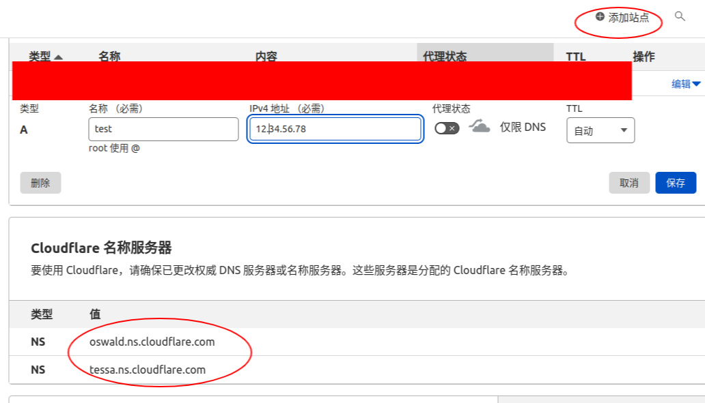
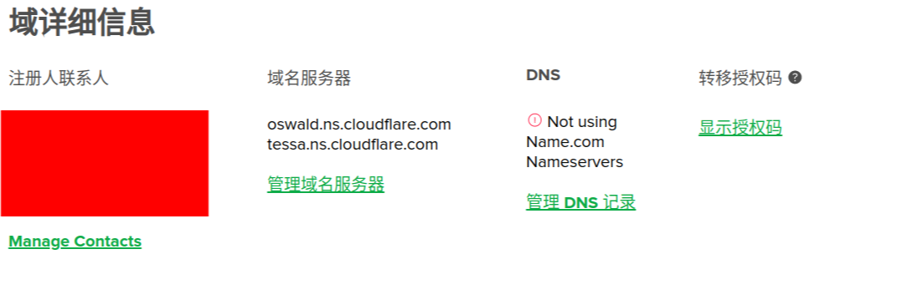
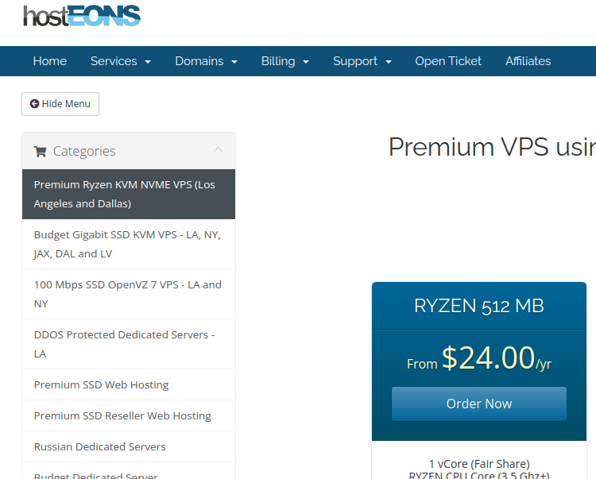
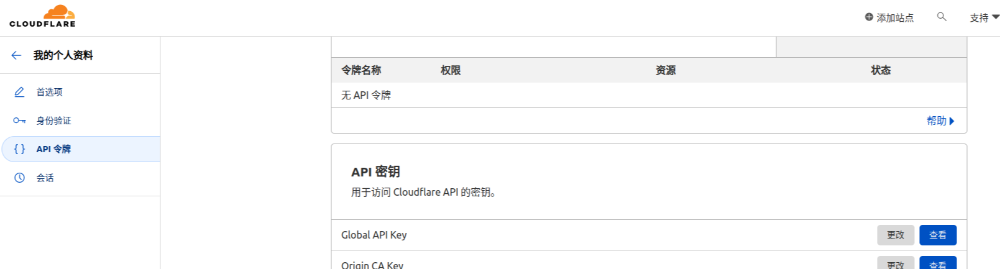
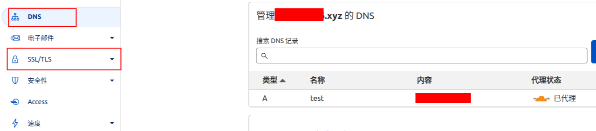
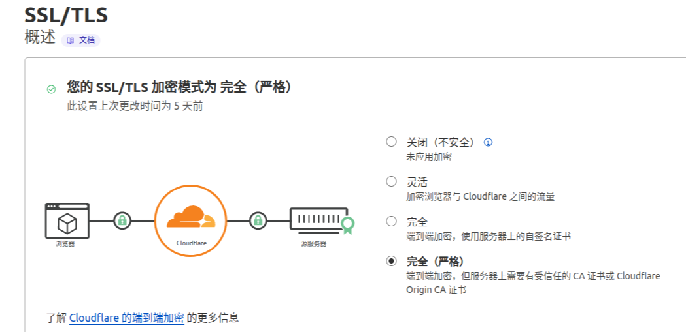
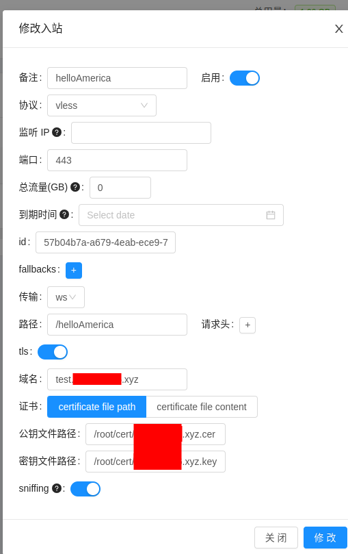
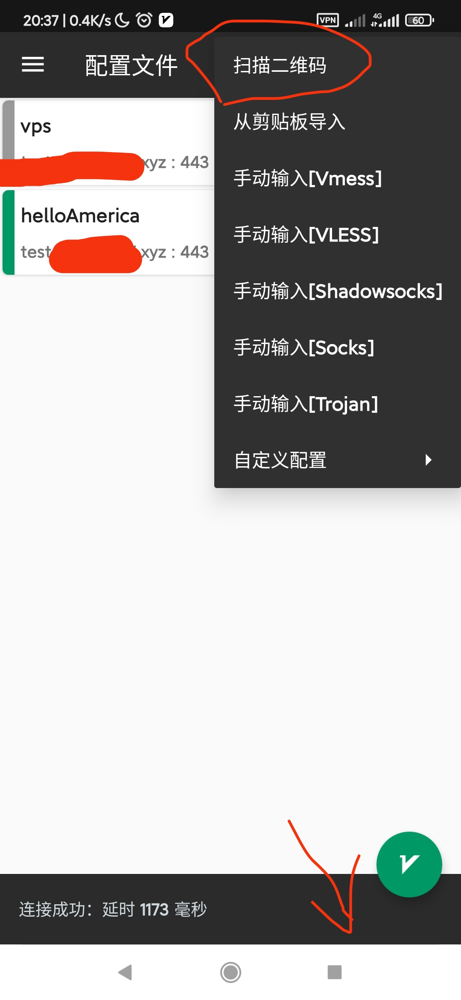

> 域名 映射到IP用的
 
经过大妈考察 选xyz域名是最便宜的 续费也是几块  
通过[推广链接](https://www.name.com/zh-cn/referral/4a3937)首次消费之后可以得到$5的优惠券   
所以先买1年的 用券抵扣续费个10年的   
> 注意事项
- 购买域名时候取消额外的服务
- 找域名搜索 {6位及以上数字}.xyz
- 查看优惠券Account => tools => REFERRAL REWARDS
- 注册用到的 [美国假身份](https://www.meiguodizhi.com/) 

> DNS代理 域名到IP绑定生效5分钟以内

https://dash.cloudflare.com/login

操作:
- 添加购买的域名 添加A记录 这个二级域名将会跳转到服务器(注意不要开代理 就是那个 小云朵 开关)
- 回到域名管理网站 替换成cloudfire的名称服务器地址
- 
  


> 采购服务器  考虑带宽 主频 流量

 经过大妈认真考察
 https://my.hosteons.com/cart.php?gid=22  
 选择了这个 
 
 资费 1年$24 每月流量500G 网速1G
使用Ubuntu最新
从网站面板找到服务器ssh登录
```bash
# 将公钥添加到远程 /.ssh/authorized_key
ssh-copy-id root@12.34.56.78
ssh root@12.34.56.78

# 安装一个前端应用 配置面板
apt update -y          
apt install -y curl socat
bash <(curl -Ls https://raw.githubusercontent.com/vaxilu/x-ui/master/install.sh) #X-ui面板安装

# 命令行进入面板应用
x-ui
```
> 命令行界面 选择16，申请 SSL泛域名证书 
>
域名:是你申请的xxoo.com  不是test.xxoo.xyz 这是泛域名证书,适用所有子域  
询问你api密钥  
cloudfire面板 > 点击你的域名 > 左边菜单栏:概述 > 右边栏:API>获取您的apikey 拿到 `Global api key`

生成的证书目录路径：/root/cert

浏览器访问面板

> 打开代理



> 配置

注意 在这时因为被代理了 无法通过域名(test.xxoo.xyz:端口)访问面板   
输入ip访问(12.34.56.78:端口)  

面板> 入站规则 (vless 端口443 ws+tls)如下


> 客户端

Ubuntu: https://snapcraft.io/qv2ray   
Android客户端 https://qv2ray.net/ 

客户端扫二维码读取配置

延迟看着高 其实用起来嘎嘎的 带宽在那儿
# 完成